# Reproducción de resultados

## Parámetros fijos

| Parámetro | Valor
|---|---|
| $L$ | 10 m |
| $r_c$ | 1 m |
| $v$ | $3\times10^{-2}$ m/s |
| $\Delta t$ | 1 s |
| $\rho$ | 2, 4, 8 m⁻² (da $N = \rho L^2 = 200$, 400 y 800)
| ruido | uniforme en $[-\eta/2, \eta/2]$ |
| realizaciones | 10 |
| $T$ | $10^4$ pasos (se decide en el paso 2) |
| $t^*$ | 3000 s (se decide en el paso 2 ) |

Compilar el motor antes de todo:

```bash
cmake -S . -B build -DCMAKE_BUILD_TYPE=Release && cmake --build build -j
```

Deja `build/OffLattice-TP2` y `build/Cluster-TP2`.

---

## Paso 0 — Esquema del sistema

Es el dibujo con $L$ y $r$ marcados **sobre el dibujo**

```bash
python3 scripts/plotters/plot_system.py
```

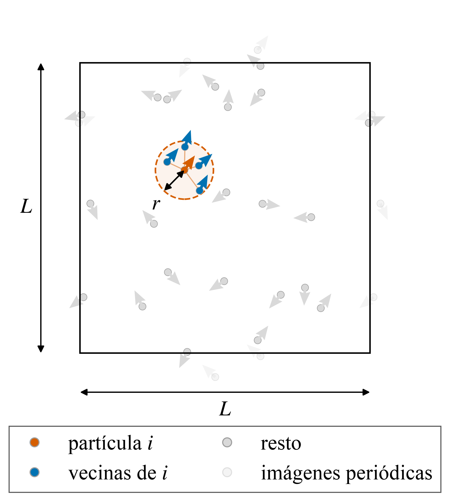

Escribe `data/figuras/sistema.png`. Las escalas son las reales ($L = 10$ m, $r = 1$ m) pero las partículas son de juguete. Con las 200 de verdad el anillo de radio $r$ desaparece entre las flechas y no se lee nada xd.

---

## Paso 1 — Punto (a): animaciones

| Par | Casos | Qué cambia |
|---|---|---|
| Ruido | `vicsek_rho4_eta0.1`, `vicsek_rho4_eta5.0` | $\eta$, a $\rho=4$ |
| Densidad | `vicsek_rho2_eta1.0`, `vicsek_rho8_eta1.0` | $\rho$, a $\eta=1$ |
| Votante | `voter_rho4_eta0.1`, `voter_rho4_eta5.0` | la regla, contra el primer par |

```bash
python3 scripts/runners/animation_runner.py --output-dir data/animaciones
```

Deja, por cada caso, `data/animaciones/<caso>.txt` (trayectoria), `<caso>.gif` y `stills/<caso>/t{0,mid,last}.png`.


| $\eta = 0.1$ rad (ordenado) | $\eta = 5$ rad (desordenado) |
|---|---|
| 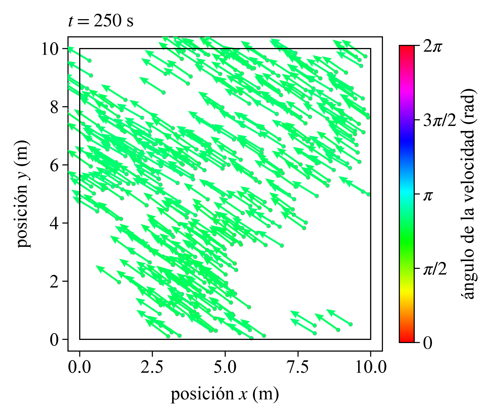 | 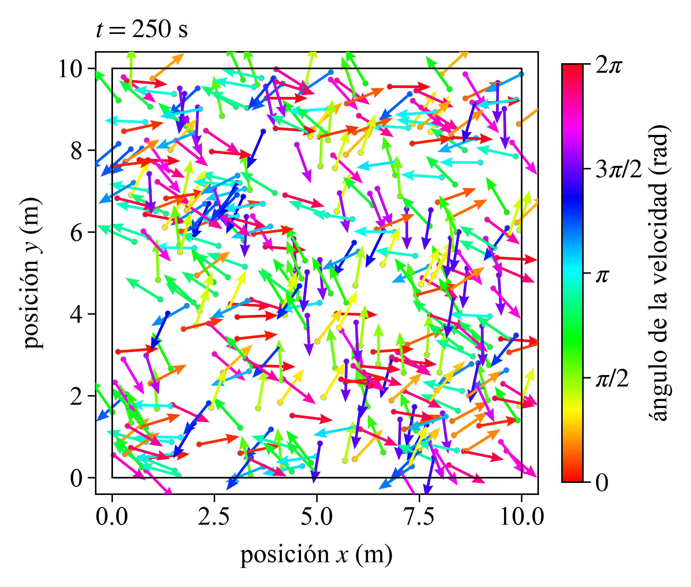 |

| $\rho = 2$ m⁻² | $\rho = 8$ m⁻² |
|---|---|
| 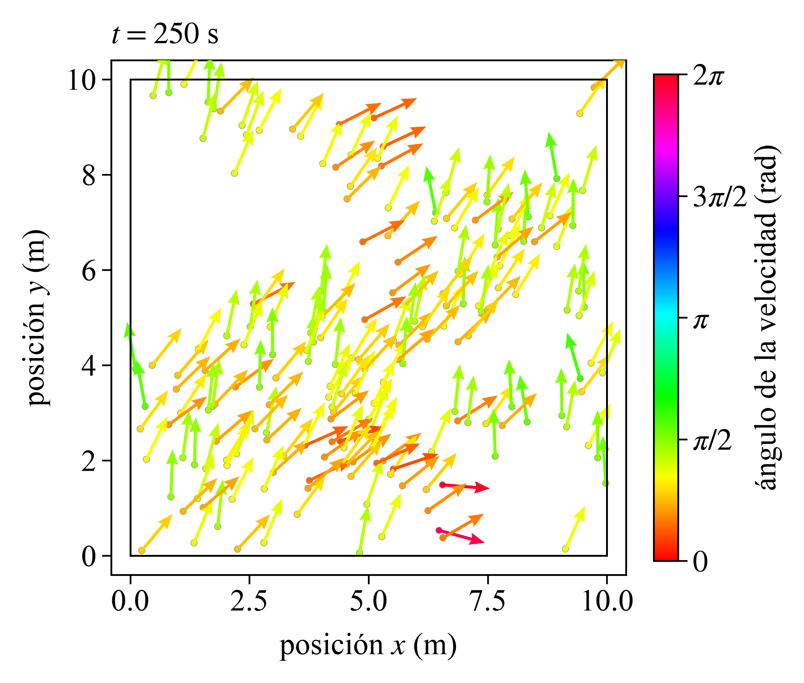 | 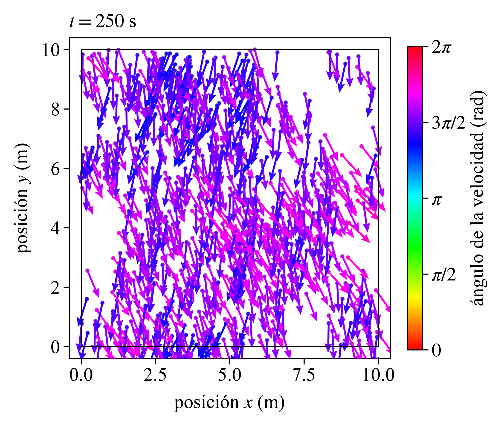 |

| votante, $\eta = 0.1$ rad | votante, $\eta = 5$ rad |
|---|---|
| 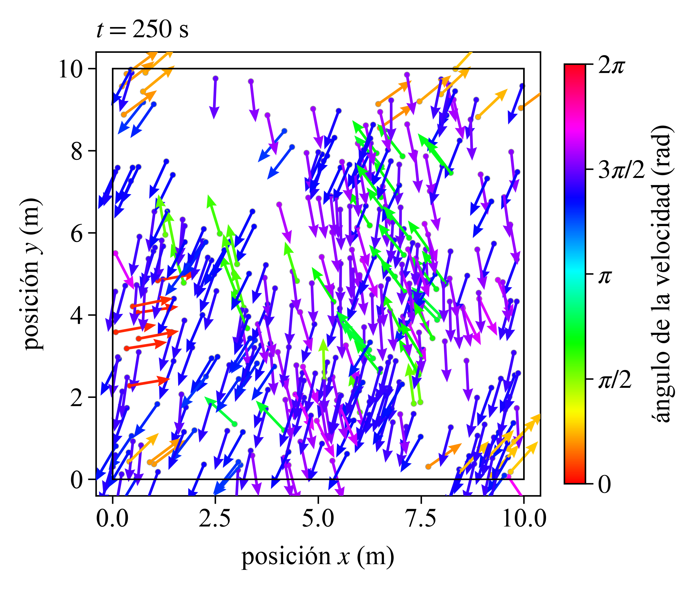 | 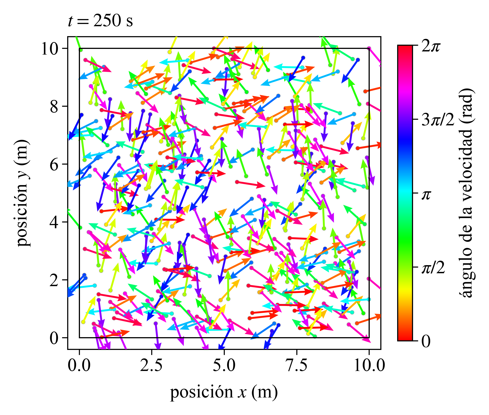 |


```bash
python3 scripts/runners/animation_runner.py --output-dir data/animaciones \
    --frames-dir presentation/figs/frames --plot-only --no-gif
```

---

## Paso 2 — Punto (b): evolución temporal y elección de $t^*$

* $\eta$ = 0.1, 1.0, 3.0, 6.0 rad: uno bajo (ordenado), dos medios y uno alto (desordenado).
* $\rho$ = 2, 4, 8: para verificar que el mismo criterio sirve en las tres densidades.
* $T = 10^4$ pasos: el votante a $\rho = 8$ con $\eta = 0.1$ sigue ordenándose hasta ~2500 s y hay que ver ese transitorio entero **y** dejar suficiente tiempo para el estacionario
* Los dos modelos en la misma figura, porque (f) pide comparar el votante "en las figuras construidas en los puntos (b, c, d y e)"*.

### 2.1 Primero: observar (sin $t^*$)

```bash
python3 scripts/va_evolution_runner.py \
	--offlattice-executable build/OffLattice-TP2 \
	--output-dir data/va-evolution-b \
	--rho 2 4 8 --eta 0.1 1.0 3.0 6.0 \
	--steps 10000 --runs 10
```

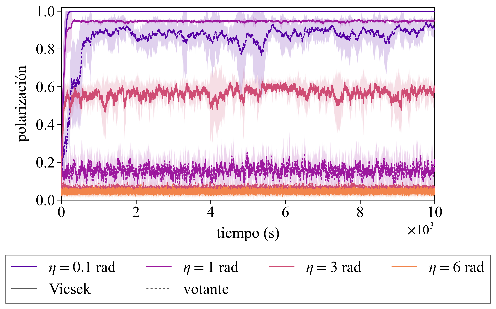

Las otras dos densidades:

| $\rho = 2$ | $\rho = 8$ |
|---|---|
|  | 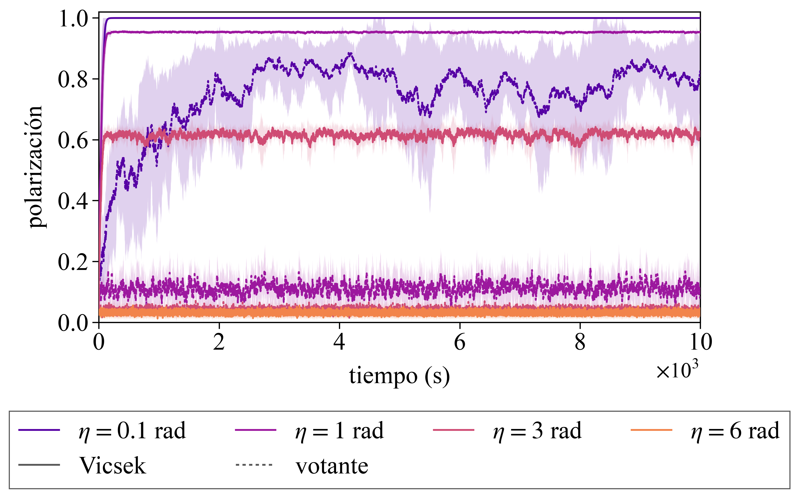 |

Archivos que deja en `data/va-evolution-b/`:

- `<modelo>_rho<ρ>_eta<η>/va.txt` — `t average_va std_va` entre las 10 corridas para dibujar esta figura. El desvío se puede prender con `--std`; está apagada por defecto.
- `<modelo>_rho<ρ>_eta<η>/runs/run-N.txt` — la serie de cada corrida por separado. **No borrar**: de aca sale la barra de error del escalar y permite re-analizar sin volver a correr la simulacion.
- `stationary.txt` — `T`, `t_stat`, su origen (`ojo` / `auto`) y el escalar, acumulado entre corridas. El `auto` es la estimación del algoritmo viejo (`utils/stationary.py`) y se deja para comparar contra el umbral elegido a ojo; si al final no se usa, se puede sacar.

### 2.2 Segundo: elegir $t^*$

El caso que manda es **el votante a $\rho = 8$ con $\eta = 0.1$**, que sigue subiendo hasta cerca de los 2500 s: es el transitorio más largo de todo el trabajo.

Se elige **$t^* = 3000$ s** = $0.3\,T$ pues deja ese transitorio afuera con margen y conserva el 70% de los pasos para promediar (701 muestras por corrida con `--stride 10`).

### 2.3 Tercero: marcar el umbral

```bash
python3 scripts/va_evolution_runner.py \
    --output-dir data/va-evolution-b --plot-only \
    --rho 2 4 8 --eta 0.1 1.0 3.0 6.0 --t-stat 3000
```

`--plot-only` reusa los `va.txt` y sólo redibuja sin volver a simular.

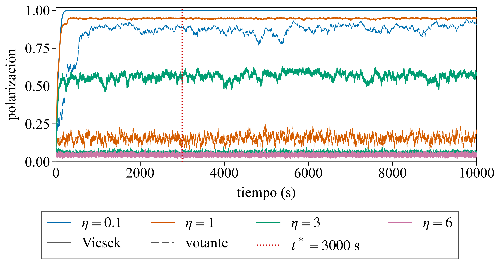

Las otras dos densidades para que $t^*$ sirve:

| $\rho = 2$ | $\rho = 8$ |
|---|---|
| 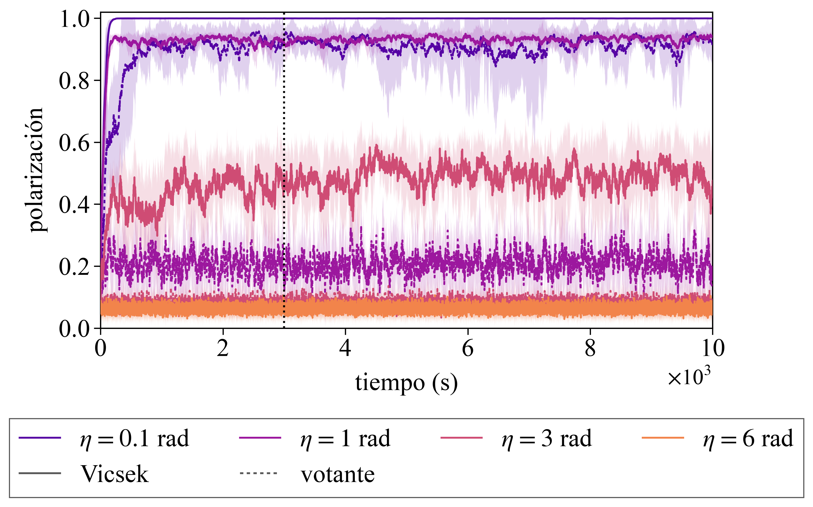 | 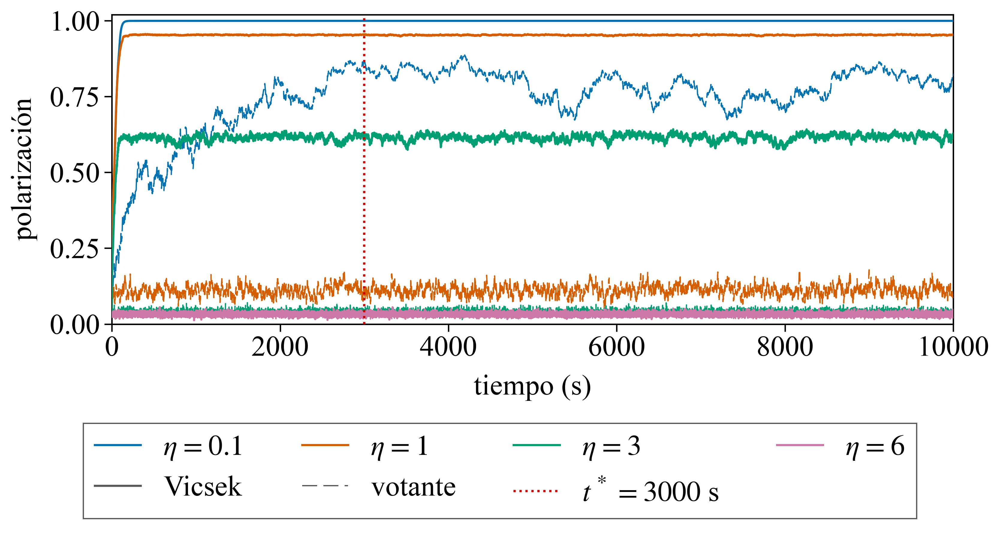 |

Y la de Vicsek solo (las de un solo modelo se escriben en `por-modelo/` para no mezclarse con las comparadas):

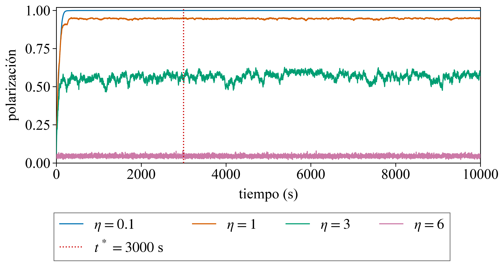

---

## Paso 3 — Punto (c): $\langle v_a \rangle$ en función del ruido

* $t^* = 3000$ s y $T = 10^4$ pasos: los mismos del punto b
* `--stride 10`: acá interesa el escalar, no la forma del transitorio
* $\eta$: **19 valores**: ver abajo

### 3.1 La grilla de ruidos

Se empezo con 13 valores elegidos con lo que ya se sabía del punto b: Vicsek cae entre 1 y 5, el votante abajo de 1. Grilla inicial:

```
0.1 0.25 0.5 0.75 1 1.5 2 2.5 3 3.5 4 5 6
```
Con estos ruidos, entre $\eta = 4$ y $\eta = 5$ la curva de Vicsek a $\rho = 4$ pasaba de $0.290$ a $0.068$ de forma abrupta y la transición era un segmento recto completamente recto.

Por eso se agregaron seis ruidos, tres en cada caída:

```
0 0.15 0.2 0.35        (abre la caída del votante)
4.25 4.5 4.75        (abre la de Vicsek)
```


**La grilla final son 20 valores:**

```
0 0.1 0.15 0.2 0.25 0.35 0.5 0.75 1.0 1.5 2.0 2.5 3.0 3.5 4.0 4.25 4.5 4.75 5.0 6.0
```

### 3.2 Correr el barrido

Este mismo barrido se usa para (c), (d) y (e): el runner corre `Cluster-TP2` sobre cada trayectoria y deja `cluster_s.txt` al lado de `va.txt`.

```bash
for modelo in vicsek voter; do
  for rho in 2 4 8; do
    python3 scripts/runners/offlatice_noise_runner.py \
        --offlattice-executable build/OffLattice-TP2 \
        --cluster-executable build/Cluster-TP2 \
        --output-dir data/noise-sweep-c/${modelo}_rho${rho} \
        --model $modelo --rho $rho \
        --noise-list 0 0.1 0.15 0.2 0.25 0.35 0.5 0.75 1.0 1.5 2.0 2.5 3.0 3.5 4.0 4.25 4.5 4.75 5.0 6.0 \
        --runs 10 --steps 10000 --stride 10 \
        -L 10 --rc 1 --speed 0.03
    rm -rf data/noise-sweep-c/${modelo}_rho${rho}/eta*/trajectories \
           data/noise-sweep-c/${modelo}_rho${rho}/eta*/cluster-results
  done
done
```

**OBS! dura aprox 1hr en total...**

El runner deja un `config.txt` en la raíz de cada barrido (`model`, `rho`, `noise_list`, y todo lo demás) y otro adentro de cada `eta*/`.

### 3.3 Cómo se calcula el escalar y su barra de error

Cada corrida se promedia **por separado** desde $t^*$ hasta el final; el punto de la figura es el promedio de las 10 corridas y la barra es su desvío. Mide cuán reproducible es el escalar.

### 3.4 Graficar

```bash
python3 scripts/plotters/plot_noise_va.py \
    --input-dir data/noise-sweep-c/vicsek_rho2 \
    --input-dir data/noise-sweep-c/vicsek_rho4 \
    --input-dir data/noise-sweep-c/vicsek_rho8 \
    --input-dir data/noise-sweep-c/voter_rho2 \
    --input-dir data/noise-sweep-c/voter_rho4 \
    --input-dir data/noise-sweep-c/voter_rho8 \
    --t-stat 3000 \
    --output data/figuras/va_vs_eta.png
```

Output son tres figuras y un txt: la comparada, las dos de un solo modelo en `por-modelo/`, y `va_vs_eta.txt` con los escalares y sus errores.
Otros flags: `--log` (escala logarítmica en la polarización), `--no-per-model` y `--per-model-dir`.

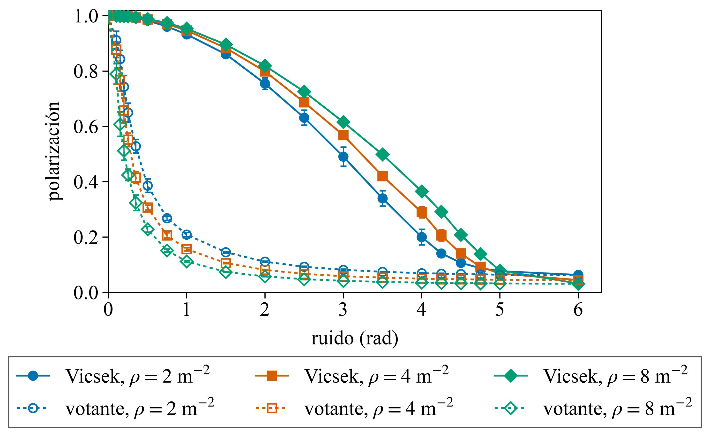

Solo Viscek:

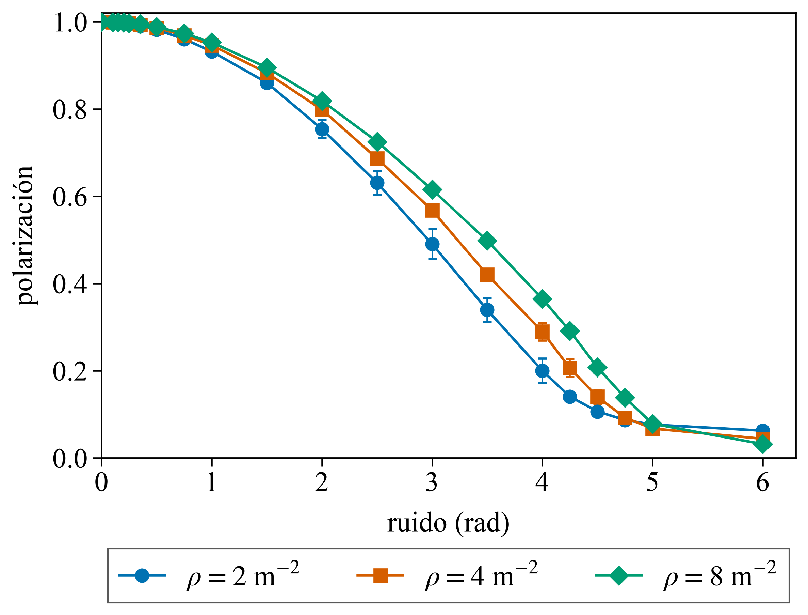

Extracto de `data/figuras/va_vs_eta.txt`:

| $\eta$ (rad) | Vicsek $\rho=2$ | $\rho=4$ | $\rho=8$ | votante $\rho=2$ | $\rho=4$ | $\rho=8$ |
|---|---|---|---|---|---|---|
| 0.1 | 0.999 | 0.999 | 1.000 | 0.912 | 0.877 | 0.789 |
| 0.5 | 0.982 | 0.986 | 0.988 | 0.386 | 0.307 | 0.228 |
| 1 | 0.932 | 0.946 | 0.953 | 0.209 | 0.156 | 0.112 |
| 3 | 0.491 | 0.568 | 0.616 | 0.082 | 0.058 | 0.042 |
| 4.5 | 0.107 | 0.141 | 0.208 | 0.052 | 0.037 | 0.026 |
| 6 | 0.063 | 0.044 | 0.032 | 0.063 | 0.045 | 0.031 |

**Conclusiones:**

* **Vicsek**: $\langle v_a \rangle$ decrece de forma monótona con el ruido de $0.999$ para $\eta = 0.1$, hasta el desorden. Y a mismo ruido, se ordena **más** cuanto mayor es la densidad ($\eta = 3$: 0.49, 0.57 y 0.62 para $\rho = 2$, 4 y 8). Promediar sobre más vecinos cancela mejor el ruido.
* **Votante**: tendencia similar pero un orden de magnitud antes en ruido. A $\eta = 1$ ya está en 0.21 / 0.16 / 0.11 cuando Vicsek todavía esta en 0.93–0.95. Cae en $\eta < 1$.
* **Votante vs. Viscek**:la dependencia con la densidad es **la opuesta** a la de Vicsek: a ruido fijo se desordena más cuanto mayor es $\rho$ (0.91 -> 0.79 a $\eta = 0.1$). Copiar a un solo vecino elegido al azar no promedia por lo  que tener más vecinos no ayuda a alinearse y solo termina acelerando la mezcla de direcciones.
-> Es decir al aumentar N (mayor densidad) se favorece el orden en Vicsek pero **no** para el votante.

---

## Paso 4 — Punto (d): clusters

```bash
# evolución temporal de S
python3 scripts/plotters/plot_sweep_evolution.py \
    --input-dir data/noise-sweep-c/vicsek_rho4 \
    --t-stat 3000 --eta 0.1 1.0 3.0 6.0 --observable s \
    --output data/figuras/s_vs_t_vicsek_rho4.png

# escalar vs ruido
python3 scripts/plotters/plot_noise_s.py \
    --input-dir data/noise-sweep-c/vicsek_rho2 --input-dir data/noise-sweep-c/vicsek_rho4 \
    --input-dir data/noise-sweep-c/vicsek_rho8 --input-dir data/noise-sweep-c/voter_rho2 \
    --input-dir data/noise-sweep-c/voter_rho4 --input-dir data/noise-sweep-c/voter_rho8 \
    --t-stat 3000 \
    --output data/figuras/s_vs_eta.png
```

**Outputs**

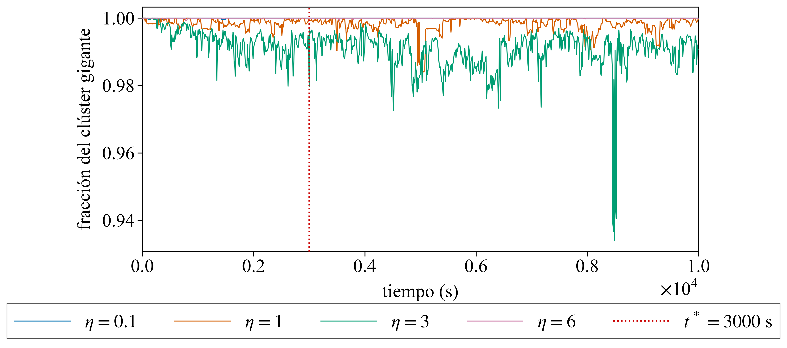

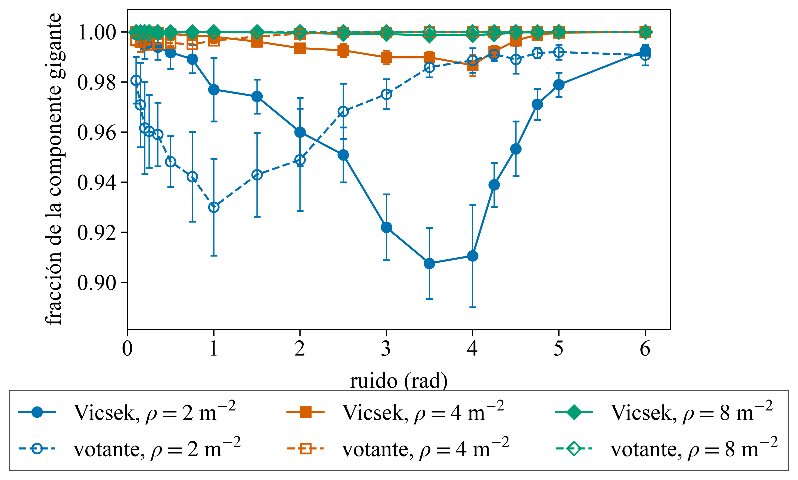

La de Vicsek:

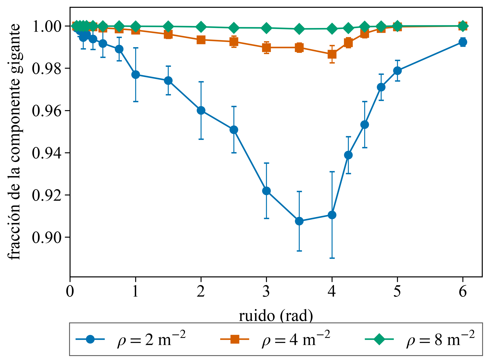

**Conclusiones.** 
[todo]

---

## Paso 5 — Punto (e): $v_a$ en función de $S$

Un punto por cada $\eta$, con coordenadas $(\langle S \rangle, \langle v_a \rangle)$: los mismos escalares de los pasos c y d.

```bash
python3 scripts/plotters/plot_s_vs_va.py \
    --input-dir data/noise-sweep-c/vicsek_rho2 --input-dir data/noise-sweep-c/vicsek_rho4 \
    --input-dir data/noise-sweep-c/vicsek_rho8 --input-dir data/noise-sweep-c/voter_rho2 \
    --input-dir data/noise-sweep-c/voter_rho4 --input-dir data/noise-sweep-c/voter_rho8 \
    --t-stat 3000 \
    --output data/figuras/va_vs_s.png
```

Flags: `--x va` para transponer ejes, y `--log` para la polarizacion logarítmica si es necesario.

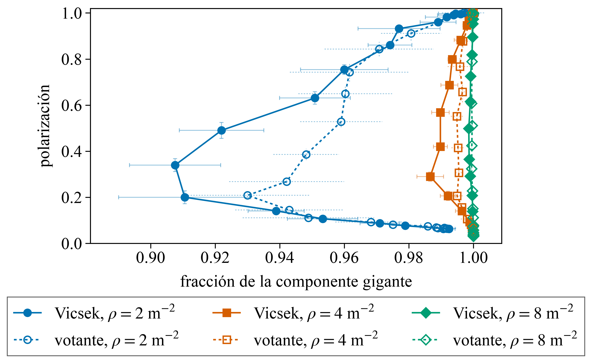

**Conclusiones**
* Para todas las densidades: tanto para viscek como para votante, a polarizacion baja (ruido alto) y alta (ruido bajo), hay un unico cluster gigante porque estan todas las particulas repartidas uniformemente (ruido alto) o porque estan todas juntas en un solo cluster mas denso (ruido bajo). y para ruido intermedio es cuando se tiene un cluster menos denso para ambos modelos.
* Viscek vs. votante: a polarizacion alta (ruido bajo) viscek mantiene la red mas conectada que votante. y en todos se ve que hay un "ruido de cruce" que pasado este el votante siempre termina teniendo la red mas conectada que viscek para la misma polarizacion. y este ruido de cruce baja con la densidad (eta=2.3, desndiad=2 -> eta=1.4, desndiad =4, -> eta=0.5, densidad=8).

---

## Paso 6 — Punto (f): comparación con el votante
Reutilizar figuras de (b), (c), (d) y (e) ya que todas ya se corrieron con `--model voter` además de `vicsek`.

---

## Paso 7 — Punto (g): tiempos de ejecución del CIM
todo